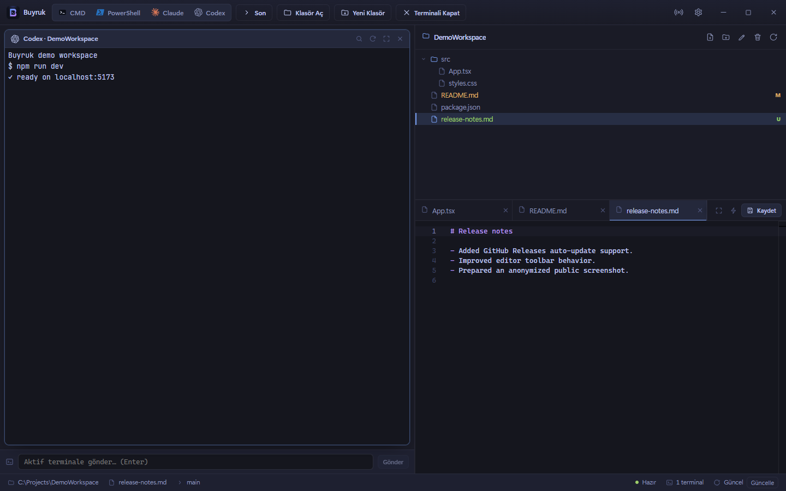

# Buyruk

Buyruk, Windows için geliştirilmiş açık kaynak bir masaüstü çalışma alanı uygulamasıdır. Tek pencerede çoklu terminal, dosya gezgini ve Monaco tabanlı kod editörü sunar.

İndirme: [v1.0.0 release](https://github.com/enesbsafak/Buyruk/releases/tag/v1.0.0)



Görseldeki proje yolu, terminal çıktısı ve dosyalar anonim örnek veridir.

## Teknoloji

Electron, React, TypeScript, Vite, xterm.js, node-pty ve Monaco Editor.

Güvenlik tarafında `contextIsolation: true` ve `nodeIntegration: false` kullanılır. Dosya sistemi, terminal ve updater işlemleri Electron main process içinde çalışır; renderer tarafına yalnızca `preload.ts` üzerinden güvenli API açılır.

## Özellikler

**Terminal çalışma alanı**

- CMD, PowerShell, Claude ve Codex oturumları.
- Birden fazla terminal açıldığında otomatik grid yerleşimi.
- Her terminal için arama, temizleme, yeniden başlatma ve zoom kontrolleri.
- Broadcast modu ile girişi tüm terminallere aynı anda gönderme.
- Aktif terminale hızlı prompt gönderme.
- Oturumları ve son klasörleri kalıcı saklama.

**Dosya gezgini**

- Aktif terminal klasörüne bağlı dosya ağacı.
- `fs.watch` ile klasör yenileme.
- Git dal bilgisi ve dosya durum rozetleri.
- Sağ tık menüsü: burada terminal aç, Explorer'da göster, yol kopyala, yeni dosya/klasör, yeniden adlandır, sil.
- `Ctrl+P` ile fuzzy dosya açma.

**Kod editörü**

- Monaco Editor.
- Sekmeli dosya açma.
- `Ctrl+S` ile kaydetme.
- Bul/değiştir, biçimlendir, kaydedilmiş sürümle diff görünümü.
- Resim önizleme ve ikili/büyük dosya koruması.

**Uygulama**

- Frameless pencere ve kalıcı pencere konumu.
- Koyu/açık tema.
- Bell bildirimi.
- GitHub Releases üzerinden otomatik güncelleme.
- Güvenli Electron ayarları: `contextIsolation: true`, `nodeIntegration: false`.

## Kurulum

Hazır Windows installer için release sayfasındaki `.exe` dosyasını indir:

```text
Buyruk-1.0.0-win-x64.exe
```

Installer henüz imzalı değildir. Bu yüzden Windows SmartScreen uyarısı gösterebilir.

## Geliştirme

Önkoşullar:

- Windows
- Node.js 22 önerilir
- Visual Studio C++ Build Tools
- Python 3

```powershell
git clone https://github.com/enesbsafak/Buyruk.git
cd Buyruk
npm install
npm run dev
```

`node-pty` native modül gerektirir. `npm install` sonrasında `scripts/rebuild-native.mjs` çalışır ve Windows build ortamında gerekli rebuild adımını dener. Derleme başarısız olsa bile uygulama açılır; terminal açarken hata alırsan:

```powershell
npm run rebuild
```

## Komutlar

```powershell
npm run dev         # Vite + Electron geliştirme modu
npm run build       # production renderer/main build
npm run typecheck   # TypeScript kontrolü
npm test            # Vitest testleri
npm run dist        # Windows installer üretir
npm run release:win # Installer üretir ve GitHub Release'e publish eder
```

## Release

Release akışı GitHub Actions ile çalışır. `v*.*.*` formatında tag push edilince workflow:

1. Windows runner'da bağımlılıkları kurar.
2. `node-pty` native modülünü rebuild eder.
3. Typecheck ve testleri çalıştırır.
4. Electron installer üretir.
5. GitHub Release asset'lerini yükler:
   - `Buyruk-<version>-win-x64.exe`
   - `Buyruk-<version>-win-x64.exe.blockmap`
   - `latest.yml`

Yeni release için:

```powershell
npm version patch
git push --follow-tags
```

Auto-update yalnızca paketlenmiş/kurulmuş sürümde çalışır. Uygulama açılışta GitHub Releases üzerinden `latest.yml` dosyasını kontrol eder; yeni sürüm indirildiğinde status bar'da **Yeniden başlat** düğmesi görünür.

## Ayarlar

Uygulama içinden şunlar değiştirilebilir:

- CMD komutu
- PowerShell komutu
- Claude komutu
- Codex komutu
- Terminal fontu ve font boyutu
- Tema
- Gizlenecek klasörler

Ayarlar localStorage içinde saklanır.

## Proje Yapısı

```text
Buyruk/
  .github/workflows/release.yml
  electron/
    fileSystem.ts
    ipcChannels.ts
    main.ts
    preload.ts
    terminalManager.ts
    updater.ts
    windowState.ts
  scripts/
    rebuild-native.mjs
  src/
    components/
    hooks/
    utils/
    App.tsx
    main.tsx
    monaco.ts
    styles.css
    types.ts
    updateTypes.ts
```

## Lisans

MIT

## Bilinen Sınırlamalar

- Yalnızca Windows hedeflenir.
- Installer şu an unsigned; public dağıtımda SmartScreen uyarısı beklenebilir.
- Auto-update geliştirme modunda çalışmaz.
- 5 MB üstü veya NUL byte içeren dosyalar metin olarak açılmaz.
- Çok fazla terminal açıldığında her pane küçülür.
