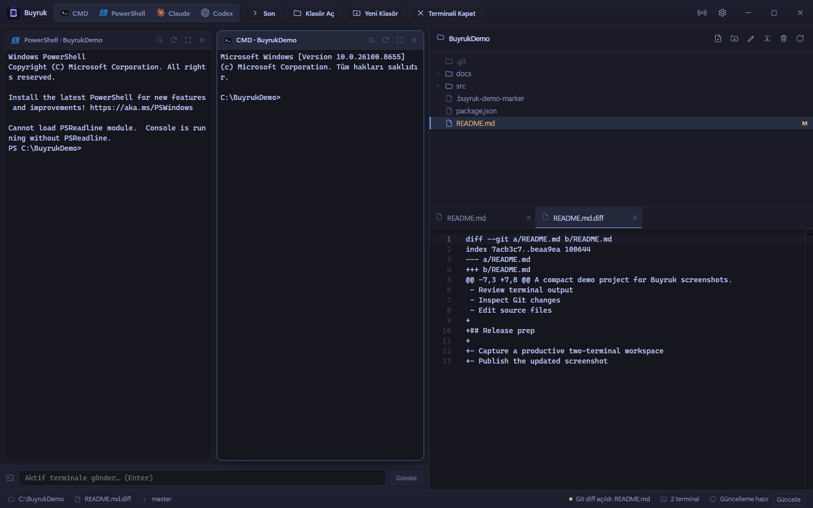

# Buyruk

Buyruk, Windows için geliştirilmiş açık kaynak bir masaüstü çalışma alanı uygulamasıdır. Tek pencerede çoklu terminal, dosya gezgini ve Monaco tabanlı kod editörü sunar.

İndirme: [son Windows release](https://github.com/enesbsafak/Buyruk/releases/latest)



Görseldeki proje yolu, terminal çıktısı ve dosyalar anonim örnek veridir.

## Teknoloji

Electron, React, TypeScript, Vite, xterm.js (WebGL renderer), node-pty ve Monaco Editor.

Güvenlik tarafında `contextIsolation: true` ve `nodeIntegration: false` kullanılır. Dosya sistemi, terminal ve updater işlemleri Electron main process içinde çalışır; renderer tarafına yalnızca `preload.ts` üzerinden güvenli API açılır.

## Özellikler

**Terminal çalışma alanı**

- CMD, PowerShell, Claude, Codex, OpenCode ve Antigravity oturumları.
- Izgara veya sekme düzeni; ızgarada sütun sayısı seçilebilir, pane sınırları sürüklenerek yeniden boyutlandırılır, pane'ler sürüklenerek sıralanır. Düzen tercihleri kalıcıdır.
- WebGL hızlandırmalı render, tıklanabilir bağlantılar ve Unicode 11 genişlik desteği.
- Terminal teması uygulama temasını (koyu/açık) takip eder.
- Her terminal için arama, yeniden başlatma ve zoom kontrolleri.
- Sağ tık menüsü: kopyala, yapıştır, tümünü seç, ara, ekranı temizle.
- Oturumlar, son klasörler ve terminal geçmişinin son satırları kalıcı saklanır; uygulama yeniden açıldığında ekran geri yüklenir.
- Shell klasör takibi (OSC 7): CMD ve PowerShell oturumlarında `cd` yapıldığında dosya gezgini takip eder. Ayarlardan kapatılabilir.
- Claude Code oturumlarında clipboard'da görsel varken `Ctrl+V` ile görsel yapıştırma.

**Dosya gezgini**

- Aktif terminal klasörüne bağlı dosya ağacı; `fs.watch` ile yenilenir ve yenileme sırasında liste ekranda kalır.
- Dosya türüne göre ikon ve renkler; klasörlerde birikimli Git değişiklik göstergesi.
- Klavye ile tam gezinme: ok tuşları, `Home`/`End`, `Enter`, `F2`, `Delete`, `Ctrl+A/C/X/V/D`, `Shift` ile aralık seçimi.
- Çoklu seçim, kes/kopyala/yapıştır/çoğalt; çakışan isimler `dosya (2).txt` olarak açılır.
- Sürükle-bırak ile taşıma ve Windows Explorer'dan dosya ekleme.
- Panel içi filtre kutusu; büyük klasörlerde otomatik sanallaştırma.
- Açık klasörler çalışma alanı başına hatırlanır.
- Gizlenecek klasörler gerçekten gizlenir; göz düğmesiyle geçici olarak gösterilebilir.
- Silinen öğeler geri dönüşüm kutusuna taşınır.
- Git dal bilgisi ve dosya durum rozetleri.
- Git diff görüntüleme: değişmiş dosyalarda araç çubuğu veya sağ tık menüsüyle read-only `.diff` sekmesi açma.
- `Ctrl+P` ile fuzzy dosya açma.

**Kod editörü**

- Monaco Editor.
- Sekmeli dosya açma.
- `Ctrl+S` ile kaydetme.
- Bul/değiştir, biçimlendir, kaydedilmiş sürümle diff görünümü ve Git diff sekmeleri.
- Resim önizleme ve ikili/büyük dosya koruması.

**Uygulama**

- Frameless pencere ve kalıcı pencere konumu.
- Koyu/açık tema.
- Bell bildirimi.
- GitHub Releases üzerinden otomatik güncelleme.
- Güvenli Electron ayarları: `contextIsolation: true`, `nodeIntegration: false`.

## Kurulum

Hazır Windows installer için release sayfasındaki `.exe` dosyasını indir:

```text
Buyruk-<version>-win-x64.exe
```

Installer henüz imzalı değildir. Bu yüzden Windows SmartScreen uyarısı gösterebilir.

`v1.0.0`-`v1.0.3` arası bir sürüm kuruluysa, unsigned installer imza doğrulama ayarı nedeniyle otomatik güncelleme hata verebilir. Bu durumda son release installer'ını bir kez manuel kur; `v1.0.4` ve sonrası unsigned GitHub Release güncellemeleri aynı publisher doğrulama hatasına takılmadan ilerler.

## Geliştirme

Önkoşullar:

- Windows
- Node.js 22 önerilir
- Visual Studio C++ Build Tools
- Python 3

```powershell
git clone https://github.com/enesbsafak/Buyruk.git
cd Buyruk
npm install
npm run dev
```

`node-pty` native modül gerektirir. `npm install` sonrasında `scripts/rebuild-native.mjs` çalışır ve Windows build ortamında gerekli rebuild adımını dener. Derleme başarısız olsa bile uygulama açılır; terminal açarken hata alırsan:

```powershell
npm run rebuild
```

## Komutlar

```powershell
npm run dev         # Vite + Electron geliştirme modu
npm run build       # production renderer/main build
npm run typecheck   # TypeScript kontrolü
npm test            # Vitest testleri
npm run dist        # Windows installer üretir
npm run release:win # Installer üretir ve GitHub Release'e publish eder
```

## Release

Release akışı GitHub Actions ile çalışır. `v*.*.*` formatında tag push edilince workflow:

1. Windows runner'da bağımlılıkları kurar.
2. `node-pty` native modülünü rebuild eder.
3. Typecheck ve testleri çalıştırır.
4. Electron installer üretir.
5. GitHub Release asset'lerini yükler:
   - `Buyruk-<version>-win-x64.exe`
   - `Buyruk-<version>-win-x64.exe.blockmap`
   - `latest.yml`

Yeni release için:

```powershell
npm version patch
git push --follow-tags
```

Auto-update yalnızca paketlenmiş/kurulmuş sürümde çalışır. Uygulama açılışta GitHub Releases üzerinden `latest.yml` dosyasını kontrol eder; yeni sürüm indirildiğinde status bar'da **Yeniden başlat** düğmesi görünür.

## Ayarlar

Uygulama içinden şunlar değiştirilebilir:

- CMD, PowerShell, Claude, Codex, OpenCode ve Antigravity komutları
- Varsayılan proje klasörü
- Terminal fontu ve font boyutu
- Terminal geçmişi (satır sayısı)
- Terminal klasör takibi (OSC 7)
- Tema
- Gizlenecek klasörler

Ayarlar localStorage içinde saklanır.

## Proje Yapısı

```text
Buyruk/
  .github/workflows/release.yml
  electron/
    fileSystem.ts
    ipcChannels.ts
    main.ts
    preload.ts
    security.ts
    terminalManager.ts
    updater.ts
    windowState.ts
  scripts/
    rebuild-native.mjs
  src/
    components/
    hooks/
    utils/
    App.tsx
    main.tsx
    monaco.ts
    styles.css
    terminalBus.ts
    terminalSnapshots.ts
    terminalTheme.ts
    types.ts
    updateTypes.ts
```

## Lisans

MIT

## Bilinen Sınırlamalar

- Yalnızca Windows hedeflenir.
- Installer şu an unsigned; public dağıtımda SmartScreen uyarısı beklenebilir.
- Auto-update geliştirme modunda çalışmaz.
- 5 MB üstü veya NUL byte içeren dosyalar metin olarak açılmaz.
- Dosya ağacındaki filtre yalnızca açık klasörlerde çalışır; tüm projede aramak için `Ctrl+P` kullanın.
- Shell klasör takibi CMD ve PowerShell oturumları içindir; AI CLI'ları çalışırken klasör bildirimi göndermez.
